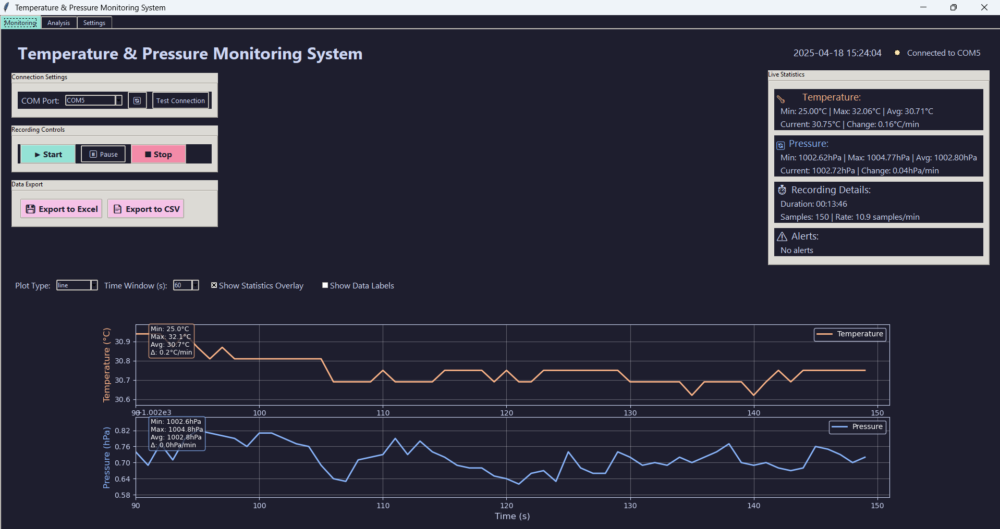
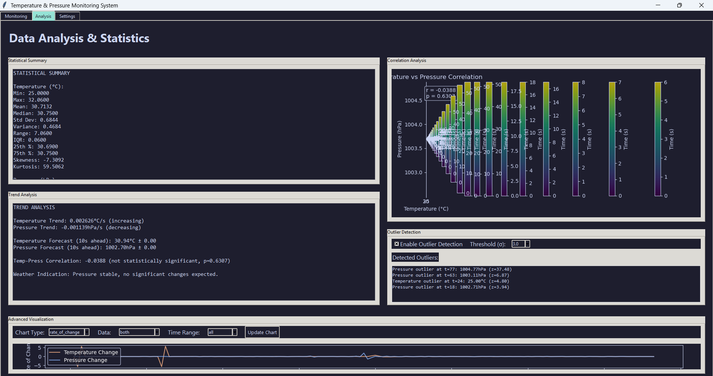
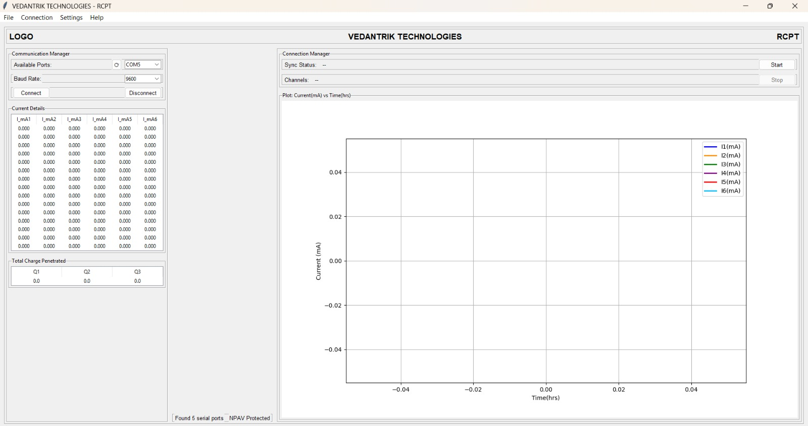

# 💡 Real-Time Environmental Monitoring System for RCPT Validation

## 📌 Project Overview

This project presents a real-time data monitoring and logging system designed to validate ambient environmental conditions prior to conducting the **Rapid Chloride Permeability Test (RCPT)** — a widely used method for assessing the durability of concrete against chloride ion penetration. The system integrates an **Arduino UNO** with temperature and pressure sensors and a custom-built **Python GUI** to display real-time data, perform statistical analysis, and allow data export to Excel for further validation and documentation.

---

## 🎯 Objectives

- Continuously monitor **temperature** and **pressure** in real time.
- Log data for **pre-test validation** of RCPT environmental conditions.
- Visualize live data through an intuitive GUI interface.
- Enable **Excel export** for documentation and analysis.
- Account for **humid tropical climates** (like Mumbai) in test preparation.

---

## 🛠️ Tech Stack

- **Hardware**:
  - Arduino UNO
  - DS18B20 Temperature Sensor
  - BMP280 Pressure Sensor
  - Breadboard & Jumper Wires

- **Software**:
  - Arduino IDE (C/C++)
  - Python 3.x
  - Tkinter (GUI)
  - Matplotlib (Plotting)
  - Pandas (Data Analysis)
  - PySerial (Serial Communication)
  - OpenPyXL (Excel Export)

- **Communication Protocols**:
  - OneWire for DS18B20
  - I2C for BMP280

---

## 🖥️ Key Features

- 📡 **Live Data Acquisition** from DS18B20 and BMP280 every 5 seconds
- 📊 **Real-Time Graphs** for Temperature and Pressure
- 🧮 **Statistical Summary** (Min, Max, Avg)
- 📤 **Export to Excel** for test documentation
- 🕒 **Optional RCPT Logger** to log readings every 30 minutes
- 🌦️ **Tested in Mumbai-like humid environments**

---

## 📷 GUI Screenshots






---

## 🔌 System Architecture

```plaintext
+------------+       +-------------+       +--------------------+
|  DS18B20   | <---> |             |       |                    |
| Temperature|       |             |       |                    |
+------------+       |             |       |                    |
                     |  Arduino UNO| <---> | Python GUI (Tkinter)|
+------------+       |             |       | - Live Plotting    |
|  BMP280    | <---> |             |       | - Excel Export     |
| Pressure   |       |             |       | - Stats Summary    |
+------------+       +-------------+       +--------------------+


## 🧰 Setup Instructions

## 📦 Python Dependencies
Ensure Python 3.x is installed. Then, install required packages:
-- pip install pyserial pandas matplotlib openpyxl


##🔌 Arduino Setup
Connect the sensors as follows:
 - DS18B20 → Digital Pin (with pull-up resistor)
 - BMP280 → I2C (SCL to A5, SDA to A4)

*Note the COM port used (e.g., COM5 or /dev/ttyUSB0).*

## ▶️ Run the GUI
 - Open a terminal or command prompt.
 - Run the GUI:


## 📈 Sample Excel Output
| Timestamp        | Temperature (°C) | Pressure (hPa) |
| ---------------- | ---------------- | -------------- |
| 2025-05-03 12:00 | 29.3             | 1008.2         |
| 2025-05-03 12:05 | 29.5             | 1007.8         |
| ...              | ...              | ...            |


## 📚 References

- 📄 [ASTM C1202 – Standard for RCPT](https://www.astm.org/c1202-19.html)
- 🔧 [Arduino DS18B20 Tutorial](https://randomnerdtutorials.com/arduino-temperature-sensor/)
- 📘 [BMP280 Documentation](https://learn.adafruit.com/adafruit-bmp280-barometric-pressure-plus-temperature-sensor-breakout)
- 🐍 Python Libraries:
  - [Tkinter](https://docs.python.org/3/library/tkinter.html)
  - [Pandas](https://pandas.pydata.org/)
  - [Matplotlib](https://matplotlib.org/)
  - [PySerial](https://pyserial.readthedocs.io/)


## 📌 License
This project is licensed under the MIT License.

## 🚀 Future Scope

- ✅ **Add humidity sensor** for deeper RCPT relevance.
- ☁️ **Integrate cloud-based monitoring and logging** for remote access and data backup.
- 📩 **Add SMS/email alerts** for threshold violations in environmental conditions.

